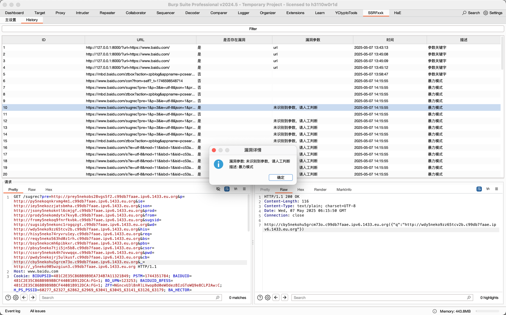

<h1 align="center">SSRFxxk - Fxxk the SSRF</h1>

<p align="center">
  
</p>

<p align="center">
  <a href="https://y5neko.github.io">
    
  </a>
  <a href="https://www.java.com">
    
  </a>
  <a href="LICENSE">
    
  </a>
</p>

# SSRFxxk

基于BurpSuite MontoyaAPI开发的SSRF模糊测试插件。

## Features

- [x] 白名单检测
- [x] 暴力模式：检测所有参数
- [x] 参数关键字模式：检测指定条件参数
- [x] 响应关键字检测：适用于有回显场景
- [x] DnsLog检测：适用于无回显场景
- [x] DnsLog平台：dig.pm（缺点：限流比较小，暴力模式下容易被误报或漏报）
- [ ] DnsLog平台：dnslog.cn
- [ ] DnsLog平台：javaweb.org
- [ ] DnsLog平台：ceye.io
- [ ] 代理池查询dnslog：防止dnslog平台限流导致误报漏报
- [ ] 自定义payload：自定义替换payload

## P.S.

本项目主要是为了方便自己使用，目前使用的其它类似插件或多或少都有点不满足自己的需求，主要还是大部分dnslog平台不太稳定，所以写了这个插件，收集尽可能多好用的dnslog平台，防止误报漏报。

当前为初始版本测试，如果大家有更好用的dnslog平台或者有更好的想法，以及一些bug，欢迎提issue或PR补充！

## Update History

- 2025-05-07: v0.0.1 初始版本

## Example

Code:
```python
from http.server import BaseHTTPRequestHandler, ThreadingHTTPServer
from urllib.parse import parse_qs, urlparse
import requests


class ProxyHandler(BaseHTTPRequestHandler):
    def do_POST(self):
        content_length = int(self.headers.get('Content-Length', 0))
        post_data = self.rfile.read(content_length).decode('utf-8')

        params = parse_qs(post_data)
        target_url = params.get('url', [''])[0]

        if not target_url:
            self.send_response(400)
            self.end_headers()
            self.wfile.write(b'Missing URL parameter')
            return

        try:
            response = requests.get(target_url, timeout=10)
            self.send_response(200)
            self.send_header('Content-type', 'text/plain')
            self.end_headers()
            self.wfile.write(response.content)
        except Exception as e:
            self.send_response(500)
            self.end_headers()
            self.wfile.write(f'Error: {str(e)}'.encode())

    def do_GET(self):
        parsed_path = urlparse(self.path)
        query_params = parse_qs(parsed_path.query)

        target_url = query_params.get('url', [None])[0]

        if not target_url:
            self.send_error(400, "Missing required 'url' parameter")
            return

        try:
            if not target_url.startswith(('http://', 'https://')):
                raise ValueError("Invalid URL scheme")

            response = requests.get(
                target_url,
                timeout=10,
                allow_redirects=False
            )

            self.send_response(response.status_code)

            for header, value in response.headers.items():
                if header.lower() in [
                    'content-encoding',
                    'transfer-encoding',
                    'connection'
                ]:
                    continue
                self.send_header(header, value)

            self.end_headers()

            # 转发响应内容
            self.wfile.write(response.content)

        except requests.exceptions.Timeout:
            self.send_error(504, "Gateway Timeout")
        except requests.exceptions.ConnectionError:
            self.send_error(502, "Bad Gateway")
        except requests.exceptions.RequestException as e:
            self.send_error(500, f"Proxy Error: {str(e)}")
        except ValueError as e:
            self.send_error(400, f"Invalid Request: {str(e)}")


def run_server(port=8000):
    server_address = ('', port)
    httpd = ThreadingHTTPServer(server_address, ProxyHandler)
    print(f'Starting server on port {port}')
    httpd.serve_forever()


if __name__ == '__main__':
    run_server()
```

### DnsLog

Config:


Result:


### Keyword

Config:


Result:



## License
This project is licensed under the [MIT License](LICENSE).